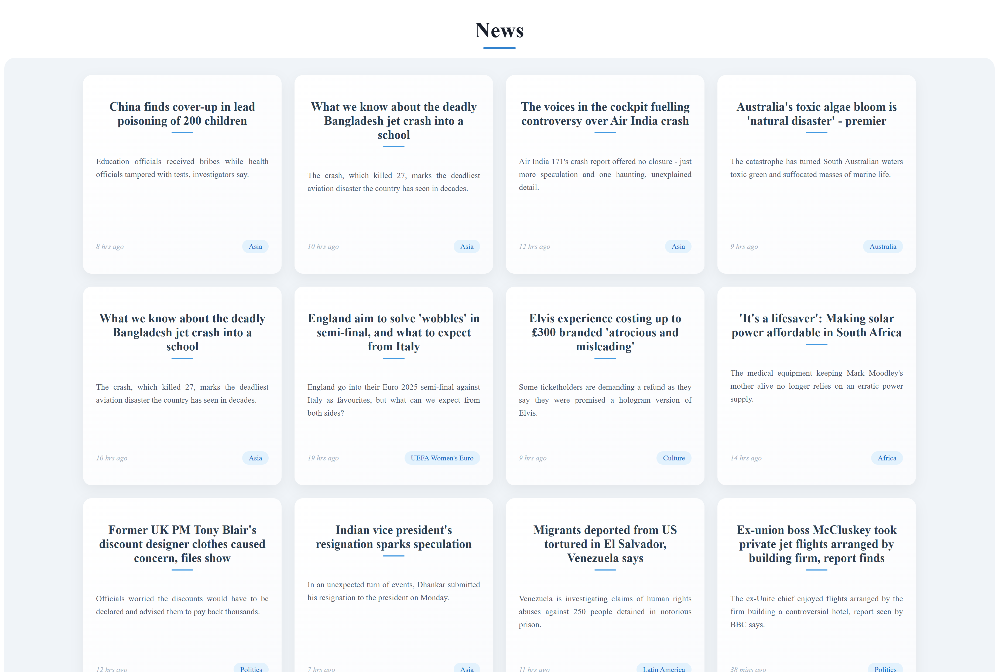

# 📰 BBC News Aggregator

A modern news aggregator app built using **FastAPI (Python)** for the backend and **React** for the frontend. This application scrapes real-time headlines and summaries from **BBC News**, delivering them through a clean, responsive interface.

---

## 🚀 Features

- 🔍 Real-time scraping from BBC News
- ⚡ Fast and lightweight API using FastAPI
- 💻 Frontend built with React
- 📄 Clean, card-based UI to display news articles
- 🔁 Refreshes latest news dynamically

---

## 🛠️ Tech Stack

### Frontend:

- React
- Axios (or Fetch API)
- CSS

### Backend:

- Python
- FastAPI
- Selenium

---

## 📦 Installation

1. Clone the repository

```bash
git clone https://github.com/Poorna-Raj/News-Aggregator.git
```

### 🔧 Backend (FastAPI)

1. Move to the directory

```bash
cd backend
```

2. Create a virtual enviroment

```bash
python -m venv venv
```

3. Activate the virtual enviroment

- On Windows:

```bash
venv\Scripts\activate
```

- On MacOs/Linux:

```bash
source venv/bin/activate
```

4. Install dependencies

```bash
pip install -r requirements.txt
```

5. Run the server

```bash
fastapi dev main.py

```

### 🔧 Frontend (React)

1. Move to the location

```bash
cd "frontend/news-app"
```

2. Install node modules

```bash
npm install
```

3. Run the server

```bash
npm run dev
```

---

## 📸 Screenshots

## 

## 🧠 Future Improvements

- Category-based filtering (e.g., Tech, World, Sports)
- User authentication for saving favorite articles
- Dark mode
- Caching and performance optimization

---

## 📄 License

This project is licensed under the MIT License.

---

## 👤 Author

Poorna Rajapaksha

Email: poornarajapaksha339@gmail.com
